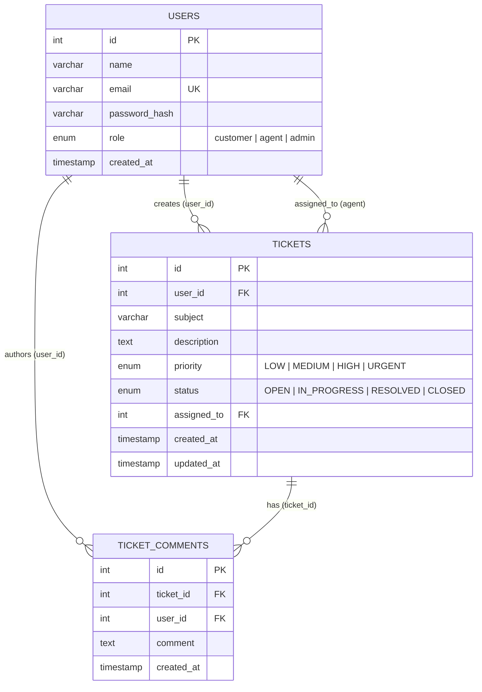

# 🎫 Support Ticket Management System

> **Junior Full Stack Developer – Technical Assessment Project**  
> A production-ready, full-stack Support Ticket Management Portal built with **React (Vite + Tailwind CSS)**, **Node.js (Express.js)**, and **MySQL 8.0**, featuring robust JWT authentication, role-based access control (RBAC), parameterized queries, automated Jest tests, and a Postman API collection.

---

## 📌 Table of Contents
1. [Project Overview](#-project-overview)
2. [Key Features by Role](#-key-features-by-role)
3. [Technology Stack](#-technology-stack)
4. [Database Design & Schema](#-database-design--schema)
5. [Section 8: SQL Query Demonstration](#-section-8-sql-query-demonstration)
6. [API Architecture & Endpoints](#-api-architecture--endpoints)
7. [Directory Structure](#-directory-structure)
8. [Getting Started (Local Setup)](#-getting-started-local-setup)
9. [Pre-configured Demo Accounts](#-pre-configured-demo-accounts)
10. [Automated Testing (Jest & Supertest)](#-automated-testing-jest--supertest)
11. [Postman Collection & API Testing](#-postman-collection--api-testing)
12. [Docker & Containerized Deployment](#-docker--containerized-deployment)
13. [Cloud Deployment Guide](#-cloud-deployment-guide)
14. [Security & Best Practices](#-security--best-practices)

---

## 🚀 Project Overview

The **Support Ticket Management System** addresses a common enterprise business scenario: customers need an intuitive, transparent interface to raise issues and track their progress, while support teams need a centralized command center to prioritize, assign, status-track, and resolve tickets collaboratively.

### Core Highlights
- **Strict Role Separation**: Customers can only view and manage their own tickets; Support Agents can view, triage, assign, and update any ticket.
- **Real-Time Dashboards**: Agent console features live KPI stat cards (Total, Open, In Progress, Resolved, Urgent, Unassigned).
- **Communication Threads**: Full comment history between customers and agents with role badges and timestamps.
- **Relational Integrity**: Foreign keys with `ON DELETE CASCADE` / `ON DELETE SET NULL`, indexed lookups, and parameterized SQL queries preventing SQL injection.
- **Verified Automated Suite**: 28 passing unit and integration tests covering security, authentication, and access control.

---

## 👥 Key Features by Role

| Feature | Customer Role | Support Agent Role |
| :--- | :---: | :---: |
| **Registration & Login** | Self-registration & Login | Admin/Pre-provisioned login |
| **View Own Tickets** | ✅ Full Access | ✅ Full Access |
| **View Other Customers' Tickets** | ❌ **Strictly Forbidden (403)** | ✅ Allowed |
| **Raise New Support Ticket** | ✅ Subject, Description, Priority | ✅ Allowed |
| **Update Status / Priority** | ❌ Forbidden (Read-only) | ✅ Full Control |
| **Assign Ticket to Agent** | ❌ Forbidden | ✅ Full Control |
| **Edit Ticket Details** | ✅ Allowed if status is `OPEN` | ✅ Allowed |
| **Delete Ticket** | ✅ Allowed only if `OPEN` | ✅ Allowed |
| **Add & View Comments** | ✅ On own tickets | ✅ On all tickets |
| **View Operational KPI Statistics** | ❌ Forbidden (403) | ✅ Real-time metrics |

---

## 🛠 Technology Stack

| Layer | Technology | Details |
| :--- | :--- | :--- |
| **Frontend** | React 18 (Vite) | Tailwind CSS, Lucide React icons, React Router DOM v6, Axios |
| **Backend** | Node.js + Express.js | Modular controller-service-route architecture |
| **Database** | MySQL 8.0 | InnoDB engine, Foreign keys, Indexes, Connection pool |
| **Authentication** | JWT (JSON Web Tokens) | Bcrypt.js password hashing (10 salt rounds), Bearer tokens |
| **API Testing** | Postman | Postman Collection v2.1.0 & Environment variables |
| **Automated Testing** | Jest + Supertest | 28 Integration test cases with database verification |
| **Containerization** | Docker & Docker Compose | Multi-stage production builds for backend, frontend & MySQL |

---

## 🗄 Database Design & Schema

The relational database schema is located in [`database/schema.sql`](file:///c:/Users/hp/Desktop/APP1/database/schema.sql).

### Entity Relationship Model



### Table Definitions & Key Constraints
1. **`users` Table**:
   - `id`: `INT AUTO_INCREMENT PRIMARY KEY`
   - `name`: `VARCHAR(100) NOT NULL`
   - `email`: `VARCHAR(255) NOT NULL UNIQUE` (Indexed)
   - `password_hash`: `VARCHAR(255) NOT NULL` (Bcrypt)
   - `role`: `ENUM('customer', 'agent', 'admin') NOT NULL DEFAULT 'customer'` (Indexed)
   - `created_at`: `TIMESTAMP DEFAULT CURRENT_TIMESTAMP`

2. **`tickets` Table**:
   - `id`: `INT AUTO_INCREMENT PRIMARY KEY`
   - `user_id`: `INT NOT NULL, FOREIGN KEY REFERENCES users(id) ON DELETE CASCADE`
   - `subject`: `VARCHAR(255) NOT NULL`
   - `description`: `TEXT NOT NULL`
   - `priority`: `ENUM('LOW', 'MEDIUM', 'HIGH', 'URGENT') DEFAULT 'MEDIUM'` (Indexed)
   - `status`: `ENUM('OPEN', 'IN_PROGRESS', 'RESOLVED', 'CLOSED') DEFAULT 'OPEN'` (Indexed)
   - `assigned_to`: `INT NULL, FOREIGN KEY REFERENCES users(id) ON DELETE SET NULL` (Indexed)
   - `created_at`: `TIMESTAMP DEFAULT CURRENT_TIMESTAMP` (Indexed)
   - `updated_at`: `TIMESTAMP DEFAULT CURRENT_TIMESTAMP ON UPDATE CURRENT_TIMESTAMP`

3. **`ticket_comments` Table**:
   - `id`: `INT AUTO_INCREMENT PRIMARY KEY`
   - `ticket_id`: `INT NOT NULL, FOREIGN KEY REFERENCES tickets(id) ON DELETE CASCADE` (Indexed)
   - `user_id`: `INT NOT NULL, FOREIGN KEY REFERENCES users(id) ON DELETE CASCADE` (Indexed)
   - `comment`: `TEXT NOT NULL`
   - `created_at`: `TIMESTAMP DEFAULT CURRENT_TIMESTAMP`

---

## 🔍 Section 8: SQL Query Demonstration

> **Requirement**: *"Write a query that returns all open tickets along with the customer's name and email. The query should demonstrate use of a JOIN and filtering."*

The reference query is stored in [`database/queries.sql`](file:///c:/Users/hp/Desktop/APP1/database/queries.sql):

```sql
SELECT 
    t.id AS ticket_id,
    t.subject,
    t.description,
    t.priority,
    t.status,
    t.created_at,
    u.id AS customer_id,
    u.name AS customer_name,
    u.email AS customer_email
FROM tickets t
INNER JOIN users u ON t.user_id = u.id
WHERE t.status = 'OPEN'
ORDER BY t.created_at DESC;
```

### Demonstration Query Output
| ticket_id | subject | priority | status | customer_name | customer_email |
| :---: | :--- | :---: | :---: | :--- | :--- |
| `1` | Unable to access billing invoice PDF | `HIGH` | `OPEN` | John Doe | john.doe@example.com |
| `4` | Cannot reset password via email link | `HIGH` | `OPEN` | Emily Clark | emily.clark@example.com |
| `6` | Assistance updating organization tax ID | `MEDIUM` | `OPEN` | Michael Brown | michael.brown@example.com |

---

## 📡 API Architecture & Endpoints

All endpoints are prefixed with `/api`.

### 1. Authentication (`/api/auth`)
| Method | Endpoint | Access | Purpose |
| :--- | :--- | :--- | :--- |
| `POST` | `/api/auth/register` | Public | Register customer account with validation |
| `POST` | `/api/auth/login` | Public | Authenticate customer/agent and receive JWT |
| `GET` | `/api/auth/me` | Authenticated | Retrieve current user profile |

### 2. Tickets Management (`/api/tickets`)
| Method | Endpoint | Access | Purpose |
| :--- | :--- | :--- | :--- |
| `GET` | `/api/tickets` | Authenticated | Customer gets own tickets; Agent gets all tickets (supports `status`, `priority`, `search`, `sort`) |
| `POST` | `/api/tickets` | Authenticated | Create a new ticket (validates subject, description, priority) |
| `GET` | `/api/tickets/:id` | Authorized | Get single ticket with customer & assigned agent details |
| `PUT` | `/api/tickets/:id` | Authorized | Agent updates status/priority/assignee; Customer edits open tickets |
| `DELETE` | `/api/tickets/:id` | Authorized | Agent deletes ticket, or customer deletes their open ticket |
| `GET` | `/api/tickets/stats` | Agent Only | Dashboard KPI counts (total, open, in_progress, resolved, urgent) |

### 3. Comments & Collaboration (`/api/tickets/:id/comments`)
| Method | Endpoint | Access | Purpose |
| :--- | :--- | :--- | :--- |
| `GET` | `/api/tickets/:id/comments` | Authorized | Fetch chronological discussion thread for ticket |
| `POST` | `/api/tickets/:id/comments` | Authorized | Add a new comment response to the ticket |

### 4. Agent User Lookups (`/api/users`)
| Method | Endpoint | Access | Purpose |
| :--- | :--- | :--- | :--- |
| `GET` | `/api/users?role=agent` | Agent Only | Retrieve list of support agents for ticket assignment |

---

## 📂 Directory Structure

```
support-ticket-system/
├── backend/
│   ├── src/
│   │   ├── config/
│   │   │   └── db.js                 # MySQL connection pool
│   │   ├── controllers/
│   │   │   ├── authController.js     # Register, Login, Me
│   │   │   ├── ticketController.js   # Ticket CRUD, stats, filters
│   │   │   ├── commentController.js  # Add and list comments
│   │   │   └── userController.js     # Agent listing
│   │   ├── middleware/
│   │   │   ├── authMiddleware.js     # JWT verification, RBAC, access checks
│   │   │   ├── validateMiddleware.js # Input sanitization & validation
│   │   │   └── errorHandler.js       # Centralized error handler
│   │   ├── routes/
│   │   │   ├── authRoutes.js
│   │   │   ├── ticketRoutes.js
│   │   │   └── userRoutes.js
│   │   ├── scripts/
│   │   │   └── initDb.js             # Automated schema & seed loader
│   │   ├── app.js                    # Express app configuration
│   │   └── server.js                 # HTTP server listener
│   ├── tests/
│   │   └── api.test.js               # 28 Jest/Supertest test cases
│   ├── Dockerfile
│   ├── jest.config.js
│   ├── package.json
│   └── .env.example
├── frontend/
│   ├── src/
│   │   ├── api/
│   │   │   └── client.js             # Axios client with interceptors
│   │   ├── components/
│   │   │   ├── Badge.jsx             # Status, Priority, Role badges
│   │   │   ├── CommentSection.jsx    # Discussion thread component
│   │   │   ├── Modal.jsx             # Accessible modal dialog
│   │   │   ├── Navbar.jsx            # Responsive navigation & user menu
│   │   │   ├── ProtectedRoute.jsx    # Client-side route authentication guard
│   │   │   ├── StatCard.jsx          # Dashboard metric card
│   │   │   ├── TicketCard.jsx        # Rich ticket list item
│   │   │   └── TicketFilter.jsx      # Multi-criteria search/filter/sort
│   │   ├── context/
│   │   │   └── AuthContext.jsx       # Global auth state and JWT storage
│   │   ├── pages/
│   │   │   ├── AgentDashboard.jsx    # Agent statistics & triage center
│   │   │   ├── CustomerDashboard.jsx # Customer ticket list & overview
│   │   │   ├── CreateTicket.jsx      # Ticket creation form
│   │   │   ├── Login.jsx             # Login with demo quick-fill buttons
│   │   │   ├── NotFound.jsx          # 404 page
│   │   │   ├── Register.jsx          # Customer registration form
│   │   │   └── TicketDetails.jsx     # Full ticket view & comment thread
│   │   ├── App.jsx                   # React Router routes
│   │   ├── index.css                 # Tailwind CSS styles
│   │   └── main.jsx
│   ├── Dockerfile
│   ├── index.html
│   ├── package.json
│   ├── tailwind.config.js
│   ├── vite.config.js
│   └── .env.example
├── database/
│   ├── schema.sql                    # Database tables, foreign keys, indexes
│   ├── seed.sql                      # Initial sample users, tickets, comments
│   └── queries.sql                   # Section 8 query and analytical queries
├── postman/
│   ├── Support_Ticket_System.postman_collection.json
│   └── Support_Ticket_System.postman_environment.json
├── docker-compose.yml                # Docker compose orchestration
├── .env.example                      # Root environment configuration
├── .gitignore
├── package.json                      # Workspace root scripts
└── README.md
```

---

## 💻 Getting Started (Local Setup)

### Prerequisites
- **Node.js**: v18.0.0 or higher (v20+ recommended)
- **npm**: v9.0.0 or higher
- **MySQL Server**: v8.0 or higher

### Step 1: Clone the Repository
```bash
git clone https://github.com/your-username/support-ticket-system.git
cd support-ticket-system
```

### Step 2: Database Setup & Migration
Ensure MySQL service is running. You can create the database and seed it either via the included Node script or the MySQL CLI:

**Option A (Using the automated script):**
1. Configure backend environment in `backend/.env`:
   ```env
   PORT=5000
   DB_HOST=localhost
   DB_PORT=3306
   DB_USER=root
   DB_PASSWORD=your_mysql_password
   DB_NAME=support_ticket_db
   JWT_SECRET=super_secret_jwt_key_change_in_production_987654321
   ```
2. Run database initialization:
   ```bash
   npm run db:init
   ```

**Option B (Using MySQL CLI):**
```bash
mysql -u root -p < database/schema.sql
mysql -u root -p support_ticket_db < database/seed.sql
```

### Step 3: Install & Start Backend
```bash
cd backend
npm install
npm run dev
```
Backend runs at `http://localhost:5000`.

### Step 4: Install & Start Frontend
```bash
cd ../frontend
npm install
npm run dev
```
Frontend runs at `http://localhost:5173`.

---

## 🔑 Pre-configured Demo Accounts

All pre-seeded test accounts use password: **`Password123!`**

| Role | Name | Email | Password | Purpose |
| :--- | :--- | :--- | :--- | :--- |
| **Customer** | John Doe | `john.doe@example.com` | `Password123!` | Test customer ticket management & isolation |
| **Customer** | Emily Clark | `emily.clark@example.com` | `Password123!` | Test cross-customer boundary isolation |
| **Support Agent** | Sarah Jenkins | `agent.sarah@example.com` | `Password123!` | Test agent dashboard, triage, assignment |
| **Support Agent** | Alex Rivera | `agent.alex@example.com` | `Password123!` | Test agent assignment & response |
| **Administrator** | System Admin | `admin@example.com` | `Password123!` | Administrative oversight |

> 💡 **Quick Fill Feature**: The login screen includes 1-click **Quick Demo Login** buttons for John Doe and Sarah Jenkins!

---

## 🧪 Automated Testing (Jest & Supertest)

The automated test suite runs against the backend REST APIs using Jest and Supertest, executing 28 comprehensive test cases across 5 distinct test suites.

### Running Tests
```bash
cd backend
npm test
```

### Test Coverage Highlights
- ✅ **Health Check**: `GET /api/health` returns status 200 and uptime
- ✅ **Registration**: Customer registration creates hashed password and JWT
- ✅ **Email Conflict**: Duplicate email returns `409 Conflict`
- ✅ **Input Validation**: Missing fields return `400 Bad Request` with error details
- ✅ **Authentication**: Valid login returns token; invalid password returns `401 Unauthorized`
- ✅ **Data Isolation**: Customers only see tickets created by their own user ID
- ✅ **Forbidden Cross-Access (403)**: Customer attempting to view or modify another customer's ticket receives `403 Forbidden`
- ✅ **404 Not Found**: Non-existent ticket returns structured `404 Not Found`
- ✅ **Agent Oversight**: Agents can view all tickets, update statuses, and assign tickets
- ✅ **Collaboration**: Customers and agents can post comments; unauthorized users cannot comment on other customers' tickets
- ✅ **Agent Stats Security**: Customers cannot access `/api/tickets/stats` (returns `403 Forbidden`)

---

## 📮 Postman Collection & API Testing

The project includes an exported Postman Collection and Environment in the `postman/` directory:
- [`postman/Support_Ticket_System.postman_collection.json`](file:///c:/Users/hp/Desktop/APP1/postman/Support_Ticket_System.postman_collection.json)
- [`postman/Support_Ticket_System.postman_environment.json`](file:///c:/Users/hp/Desktop/APP1/postman/Support_Ticket_System.postman_environment.json)

### Importing into Postman
1. Open Postman.
2. Click **Import** in the upper left.
3. Select `Support_Ticket_System.postman_collection.json` and `Support_Ticket_System.postman_environment.json`.
4. Select the **Support Ticket System - Localhost** environment.
5. Execute requests sequentially:
   - When running **Login - Customer (John Doe)**, the response token is automatically saved into the `customerToken` variable.
   - When running **Login - Support Agent (Sarah Jenkins)**, the response token is automatically saved into `agentToken`.
   - Subsequent authenticated requests use `{{customerToken}}` or `{{agentToken}}` automatically.

---

## 🐳 Docker & Containerized Deployment

Run the complete full-stack application (MySQL database, Express backend, and Nginx-served React frontend) with a single command:

```bash
docker-compose up --build
```

- **Frontend**: `http://localhost:80`
- **Backend API**: `http://localhost:5000`
- **MySQL Server**: `localhost:3306` (initialized automatically with `schema.sql` and `seed.sql`)

---

## ☁️ Cloud Deployment Guide

The application is structured for cloud hosting across standard providers.

### 1. Database (Cloud MySQL)
- Use **Aiven**, **Railway**, **PlanetScale**, or **AWS RDS** for a managed MySQL instance.
- Run `database/schema.sql` and `database/seed.sql` on the provisioned database.

### 2. Backend (Render / Railway)
- **Build Command**: `cd backend && npm install`
- **Start Command**: `node src/server.js`
- **Environment Variables**:
  - `PORT=5000`
  - `NODE_ENV=production`
  - `DB_HOST=<remote-mysql-host>`
  - `DB_PORT=3306`
  - `DB_USER=<db-username>`
  - `DB_PASSWORD=<db-password>`
  - `DB_NAME=<db-name>`
  - `JWT_SECRET=<strong-random-secret>`
  - `CLIENT_URL=<deployed-frontend-url>`

### 3. Frontend (Vercel / Netlify / Render)
- **Framework Preset**: `Vite`
- **Root Directory**: `frontend`
- **Build Command**: `npm run build`
- **Output Directory**: `dist`
- **Environment Variables**:
  - `VITE_API_BASE_URL=https://<your-backend-url>/api`

---

## 🛡 Security & Best Practices

1. **Password Security**: Passwords are never stored in plaintext. They are salted and hashed using `bcryptjs` with 10 salt rounds.
2. **Separation of Authentication and Authorization**: `authenticateToken` strictly verifies JWT signature and validity; `requireRole` and `authorizeTicketAccess` independently enforce resource permissions.
3. **Customer Isolation**: Ownership verification ensures no customer can view, comment on, modify, or delete another customer's ticket.
4. **SQL Injection Prevention**: All queries utilize parameterized statements (`db.execute('SELECT ... WHERE id = ?', [id])`) through `mysql2/promise`.
5. **CORS Configuration**: Configured with explicit allowed HTTP methods and header definitions.
6. **Zero Secrets in Version Control**: `.env` is ignored by `.gitignore`; `.env.example` provides documentation templates without exposing sensitive keys.

---

## 📄 License
This project is developed as part of a Junior Full Stack Developer Technical Assessment.
